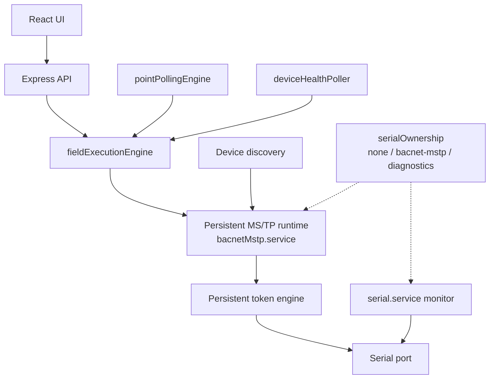

# Phase 2.5 — Runtime Architecture Completion

Phase 2.5 finishes the MS/TP runtime foundation so Phase 3 can add BACnet/IP ↔ MS/TP routing without redesigning ownership, lifecycle, or data paths.

## What changed

### Persistent token engine

- `bacnetMstp.service` owns **one** `MstpTokenEngine` for the active runtime generation.
- Started when the runtime opens the serial port; destroyed on stop / restart / recovery / config teardown.
- Discovery, point discovery, property reads, polling, and health checks **reuse** this engine.
- Operations register temporary frame handlers; they do **not** recreate the engine or attach competing data listeners.
- Tick timer and RX listener belong to the runtime, not to each job.

### Authoritative runtime state

States: `stopped` → `starting` → `listening` → `joining` → `active` ⇄ `busy` / `degraded` → `recovering` / `faulted` → `stopping` → `stopped`.

- `markBusy` / `markIdleAfterOperation` are wired into discovery and field reads.
- Runtime generation still invalidates stale job results.
- Parallel boolean flags (`activeDiscovery`, etc.) may describe *what* is running but machine `state` is authoritative.

### Serial ownership

Backend registry (`serialOwnership.js`):

| Owner | Meaning |
|-------|---------|
| `none` | Port free |
| `bacnet-mstp` | BACnet runtime holds the port |
| `diagnostics` | Serial monitor holds the port |

- Conflicts return HTTP **409** `SERIAL_OWNERSHIP_CONFLICT`.
- Ownership is process state (survives browser refresh).
- Released on stop, failure, or ownership timeout.

### Operation queue

`fieldExecutionEngine` remains the only field-operation queue:

- Bounded depth; background jobs dropped when full.
- Duplicate polling reads and device-health checks coalesce.
- Expired polling jobs discarded (no burst replay after gaps).
- Poll scheduler advances `nextPollAt` on enqueue.
- Queue summary: active op, depth, oldest age, by-type, dropped/coalesced/failed.

### Lifecycle

- Start / stop are idempotent.
- Restart and recover serialize through one lifecycle lock.
- One recovery loop; stale retries cancelled while shutting down.
- `SIGTERM` / `SIGINT`: stop pollers → cancel background jobs → stop worker → destroy token engine → close serial once → close HTTP → exit within `LEGION_SENTRY_SHUTDOWN_TIMEOUT_MS` (systemd `TimeoutStopSec=30`).

### Data directory and retention

- Production: `LEGION_SENTRY_DATA_DIR=/var/lib/legion-sentry`
- Logs: size-based rotation (`logs.jsonl` + numbered retain)
- Execution jobs: trimmed active + limited completed/failed history; high-churn job writes skip `.bak`
- Migration / sibling backups: pruned retention helpers

### Runtime dashboard and diagnostics

- UI **Runtime Dashboard** on BACnet MS/TP Advanced Diagnostics (real metrics only).
- Authenticated `GET /api/bacnet/mstp/diagnostics/export` — sanitized JSON (passwords, hashes, Wi-Fi/MQTT secrets, tokens redacted).

## Architecture

## Remaining limitations (before Phase 3)

- No BACnet/IP ↔ MS/TP NPDU routing
- WriteProperty disabled / unavailable
- COV unsupported
- Directed (unicast) Who-Is not fully implemented
- Fake transport not wired into the live service path

## Exit conditions

See the Phase 2.5 checklist in the project brief. In short: one persistent token engine, one state model, mutual serial exclusion, bounded queue, idempotent lifecycle, external data dir with retention, dashboard + redacted export, no Phase 3 routing.
