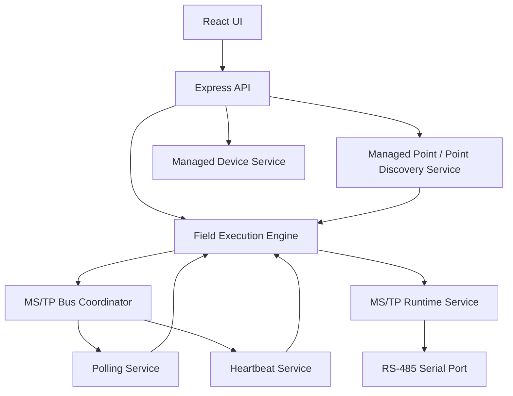

# Legion Sentry Runtime Architecture (Phase 1)

This document describes how Legion Sentry owns BACnet runtimes, serial access, jobs, and API error flow after Phase 1 stabilization.

## 1. Application startup sequence

```
server.js
  → load Express app (app.js)
  → authService.loadAuthConfig()
  → logsService.seedStartupLog()
  → fieldExecutionEngine.startWorker()   // 100ms tick
  → pointPollingEngine.start()           // 1s tick
  → deviceHealthPoller.start()           // 5s tick
  → listen(PORT)
```

Background engines submit work into the field execution queue. They do **not** open the RS-485 port themselves.

## 2. Service construction and ownership

| Service | Owns | Must not |
|---------|------|----------|
| `bacnetMstp.service` (MS/TP runtime) | SerialPort for BACnet, token engine, frame RX/TX, exclusive discovery/read sessions | Be opened by routes other than runtime API |
| `serial.service` | Diagnostics monitor / open-check only | Run concurrently with MS/TP BACnet sessions |
| `mstpBusCoordinator` | Soft bus lock + pause/resume of polling/health during trunk discovery | Open serial ports |
| `fieldExecutionEngine` | Job queue, priorities, worker serialization | Call `managedPoints.runPointDiscovery` |
| `pointDiscovery` (**canonical**) | Managed-point discovery orchestration + per-device lock + persistence of discovered points | Open serial ports |
| `managedPoints` | User-selected managed point CRUD / poll config / refresh jobs | Run point discovery |
| `managedDevices` | Managed device CRUD + heartbeat quality | Raw serial I/O |
| `pointPollingEngine` | Due-point scheduling | Hold a SerialPort |
| `deviceHealthPoller` | Heartbeat scheduling | Hold a SerialPort |
| `bacnetIp.service` | UDP BACnet/IP discovery and reads | Share MS/TP serial state |

Singletons are module-level by design for the appliance process. Circular requires that previously broke `managedPoints.runPointDiscovery` are avoided by keeping discovery in `pointDiscovery.js`.

## 3. BACnet/IP runtime

- Entry: `POST /api/bacnet/ip/discover`
- Implementation: `bacnetIp.service.discoverDevices` via `node-bacnet`
- Results ingested into inventory by `devices.ingestBacnetIpDiscovery`
- Independent of MS/TP serial ownership

## 4. BACnet MS/TP runtime

- Single owner: `backend/src/services/bacnet/bacnetMstp.service.js`
- State snapshot includes authoritative `runtimeState`:
  `stopped | starting | listening | joining | active | busy | degraded | faulted | stopping`
- Derived helpers live in `mstpRuntimeState.js`

## 5. Serial ownership

```
BACnet path:  bacnetMstp.service → SerialPort (/dev/serial0 by default)
Diagnostics:  serial.service monitorState (mutually exclusive; MS/TP refuses if monitor running)
```

Routes never call `new SerialPort` directly. Configure-via-stty remains in `serial.service.configureSerial` and is invoked by the MS/TP runtime before open.

## 6. Operation queue / scheduler

Priority (higher first) inside `fieldExecutionEngine`:

1. Runtime shutdown / recovery (coordinator cancel paths)
2. Active BACnet request completion
3. User trunk discovery (`mstpBusCoordinator` exclusive `DISCOVERY` owner)
4. User point discovery (`source: point-discovery`, priority 70)
5. User live read/write (`source: ui`, priority 60)
6. Device heartbeat (`device-health`, 45)
7. Background polling (`polling`, 10)

Rules:

- One field job executes at a time (`activeJobId`)
- Trunk discovery pauses polling + health and cancels queued background jobs
- Point discovery for the same managed device cannot start twice (`409 POINT_DISCOVERY_ALREADY_RUNNING`)
- Locks / bus owners release in `finally`

## 7. Device discovery flow

```
UI → POST /api/bacnet/mstp/discover
  → mstpBusCoordinator.prepareForDiscovery()
  → acquireBus(DISCOVERY)
  → bacnetMstp.service.discover()
  → devices.ingestBacnetMstpDiscovery()
  → finally releaseBus + resumeAfterDiscovery
```

## 8. Managed-device flow

```
UI Managed Devices
  → /api/devices/managed CRUD
  → managedDevices service + managedDevices.json (atomic write)
```

Enable/disable gates point discovery and polling eligibility.

## 9. Point-discovery flow (canonical)

```
DevicePointsModal
  → api.discoverManagedDevicePoints(id, { async: true })
  → POST /api/devices/managed/:id/discover-points
  → fieldExecutionEngine.discoverPointsForManagedDevice()
  → job type discover_points
  → pointDiscovery.discoverPointsForDevice({ managedDeviceId, requestId, ... })
  → bacnetMstp.service.discoverPointsForDevice()
  → discoveredPointsStore.saveDiscoveryResult()
```

Canonical public method: **`pointDiscovery.discoverPointsForDevice`**.  
Alias retained: `runPointDiscovery(managedDeviceId, hooks)` for internal compatibility.

`managedPoints` intentionally does **not** export discovery methods (avoids CommonJS circular export traps).

## 10. Heartbeat flow

```
deviceHealthPoller tick
  → fieldExecutionEngine.submitReadProperty({ source: 'device-health' })
  → bacnetMstp.readPropertyForDevice
  → managedDevices.recordHeartbeatResult
```

Paused while trunk discovery owns the bus.

## 11. Polling flow

```
pointPollingEngine tick
  → submitReadProperty({ source: 'polling' })
  → pointCache.applyReadSuccess / failure
```

Paused / queued jobs cancelled during trunk discovery; resumes afterward. Does not create duplicate timers on resume.

## 12. Shutdown and recovery

- `bacnetMstp.service` registers process cleanup to close the SerialPort
- Worker / poller timers are cleared on `stopWorker` / pause paths
- Failed jobs do not retain exclusive locks after `finally`

## 13. Error propagation

```
Service throws AppError subclass
  → async route handler next(err) / throw
  → middleware/errorHandler.js
  → {
      success: false,
      error: { code, message, details, requestId },
      requestId
    }
```

Status mapping:

| Condition | HTTP | Code example |
|-----------|------|--------------|
| Validation | 400 | `VALIDATION_ERROR`, `DEVICE_DISABLED` |
| Missing device | 404 | `NOT_FOUND` |
| Concurrent discovery | 409 | `POINT_DISCOVERY_ALREADY_RUNNING`, `MSTP_BUS_BUSY` |
| Serial / runtime unavailable | 503 | `SERIAL_PORT_ERROR`, `RUNTIME_UNAVAILABLE` |
| BACnet discover failure | 502 | `POINT_DISCOVERY_FAILED` |
| Unexpected | 500 | `INTERNAL_ERROR` |

## 14. Logging and request IDs

- `requestId` middleware sets `X-Request-Id` and `req.requestId`
- `services/logger` emits structured JSON to stdout and a Logs-page-compatible entry to `logs.jsonl`
- Tight poll ticks are not persisted

Example:

```json
{
  "timestamp": "2026-07-13T00:00:00.000Z",
  "level": "info",
  "source": "managed-point-service",
  "event": "point_discovery_started",
  "message": "Point discovery started.",
  "requestId": "ab12cd34",
  "operationId": "99ffaa",
  "managedDeviceId": "managed-mstp-2000004-mac-4",
  "deviceInstance": 2000004,
  "networkNumber": 2,
  "mstpMac": 4
}
```

## 15. Development mode without hardware

On Windows / hosts without `/dev/serial0`:

- UI and JSON persistence still work
- Serial open / MS/TP discover / point discover return operational serial/runtime errors (structured), not TypeErrors
- BACnet/IP discovery may work if network BACnet devices are reachable
- Automated tests mock BACnet/serial and do not require a Raspberry Pi

## Mermaid overview



## Reproducing point discovery

1. Manage an MS/TP device from inventory / Managed Devices
2. Ensure the device is **enabled**
3. Open the points modal → **Point Discovery** → **Discover**
4. Watch job progress via `/api/execution/jobs/:id`
5. Select discovered objects → **Add Selected to Managed**
